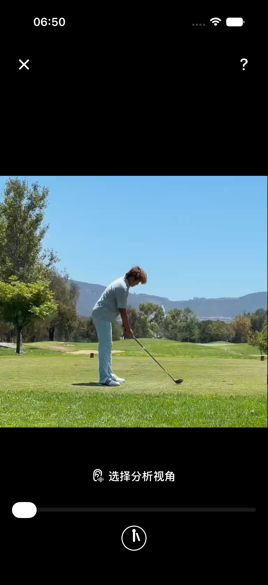
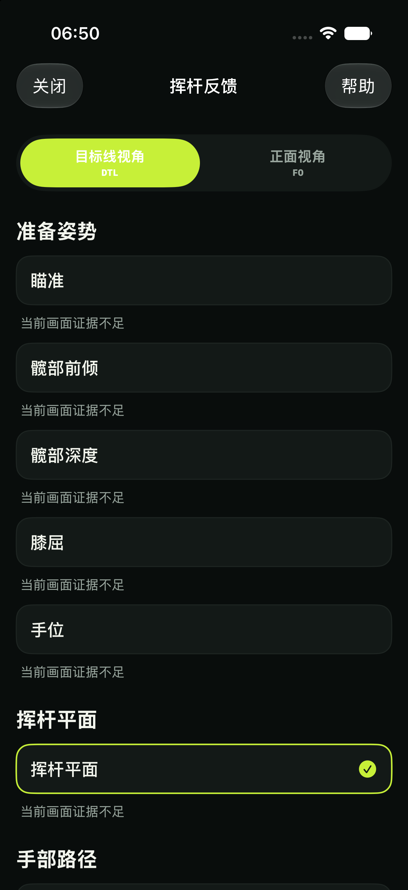
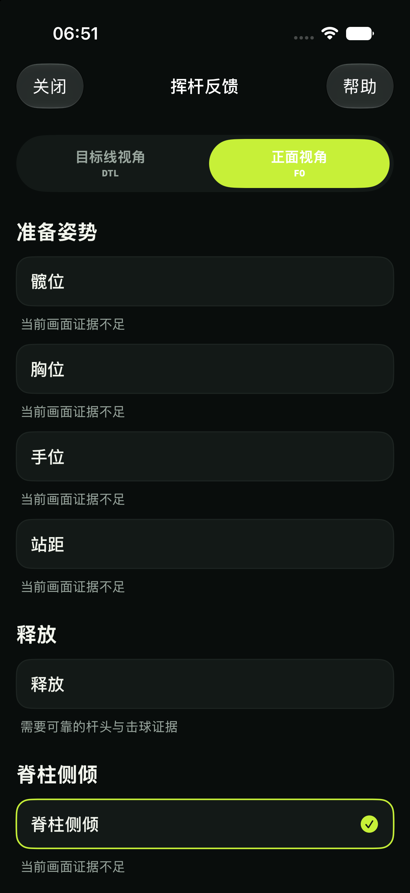

# DTL / FO 全屏回放模拟器验收记录

日期：2026-07-21  
设备：iPhone 17，iOS 27.0 Simulator  
安装：仅模拟器 `com.liangbo.swingarc`；未安装任何真机。

## 实际素材

- `SwingArc-386EF602-CFC2-4792-8B1D-80A10CBCA009.MOV`：32.39 秒。本地分析停止为“无法持续锁定主球员”。
- `11156_raw.MP4`：10.73 秒。本地分析同样停止为“无法持续锁定主球员”。
- 为验证轨道交互，在第二段视频的当前帧人工设定了 P1；该点位是手动点位，不代表 AI 分析结果。

## 验收

| 检查项 | 结果 | 证据 |
| --- | --- | --- |
| 全屏无时间文字与传统播放按钮 | 通过 | `screenshots/dtl-fo-replay-fullscreen-manual-p1.png` |
| 点视频切换播放，播放期间自动隐藏回放层 | 通过 | 模拟器实际点按；修复后触控层可稳定接收点按 |
| 参数胶囊进入独立全屏页 | 通过 | 实际点按进入“挥杆反馈”页；未显示半屏视频 |
| DTL 与正面指标不同 | 通过 | `screenshots/dtl-fo-feedback-dtl-insufficient.png`、`screenshots/dtl-fo-feedback-faceon-insufficient.png` |
| 无证据不生成技术结论 | 通过 | 两段真实素材均显示“无法持续锁定主球员” |
| 正面“释放”缺少杆头/击球证据时不可用 | 通过 | 正面配置页显示“需要可靠的杆头与击球证据” |
| 缺失阶段不显示剪影 | 通过 | 只显示已人工设定的 P1；其余 P2–P8 未显示 |
| 剪影可跳转到已有点位 | 通过 | P1 剪影具备“跳到该挥杆位置”的无障碍动作 |
| 未安装真机 | 通过 | 本轮只使用 iPhone 17 Simulator |

## 截图

